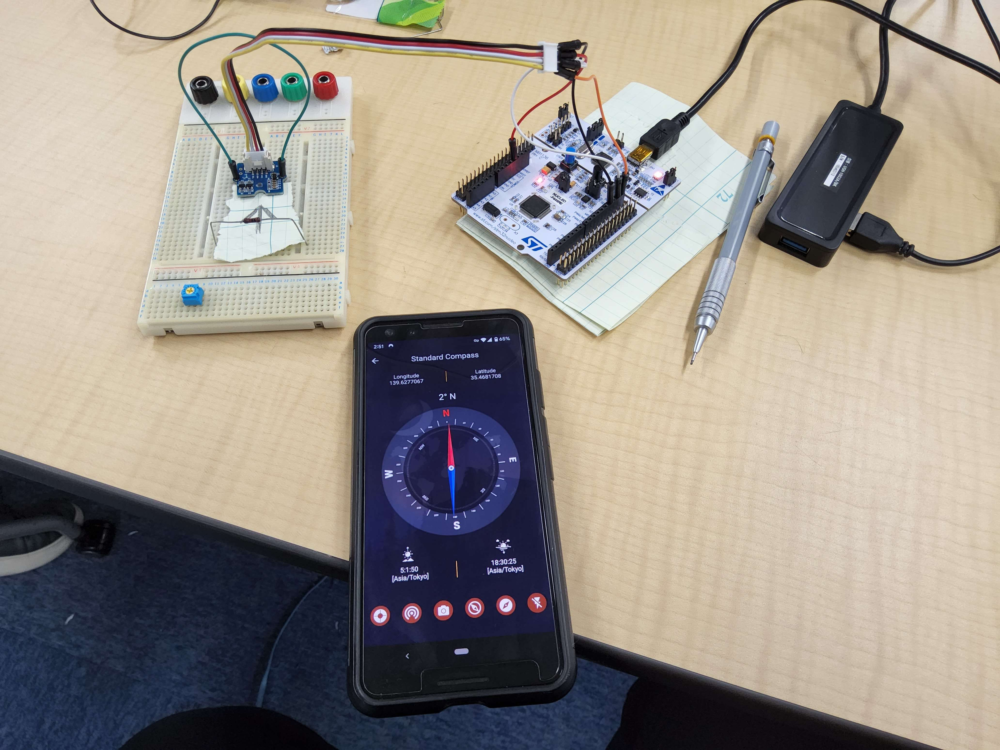
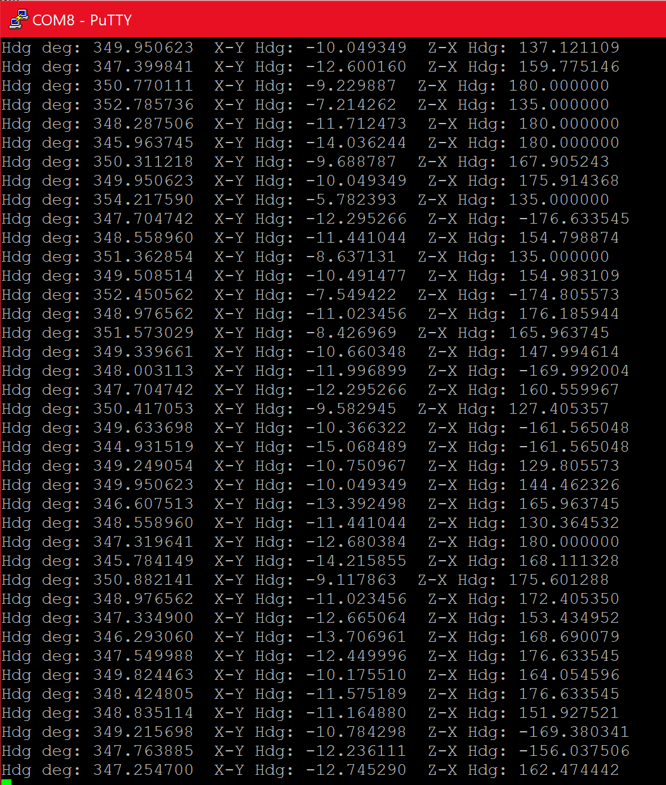
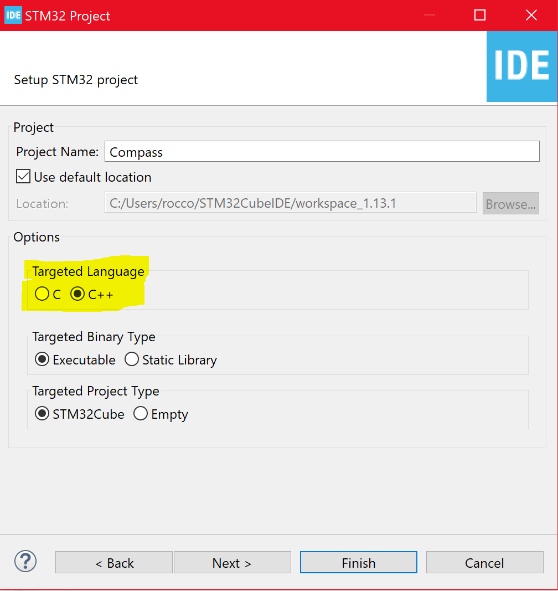

# BMM150 STM32 F446RE

### About
To use the STM32 Nucleo F446RE board with the Grove BMM-150 module, this header file and example can be a starting point for your next project. Building off of the [code](https://github.com/Seeed-Studio/Grove_3_Axis_Compass_V2.0_BMM150) originally written for the Arduino using the wire library, this implementation uses the HAL I2C implementation to access the data registers on the BMM150 board. 
#### [Bosch Documentation for the BMM150](https://www.bosch-sensortec.com/media/boschsensortec/downloads/datasheets/bst-bmm150-ds001.pdf)

# Setup
The first thing to do is open the STM IDE. From here, start a new project, select your board and ensure you select C++ as the target language. 

With that set, you can now select your MX file and confgure the board as shown in this [guide](https://wiki.st.com/stm32mcu/wiki/Getting_started_with_I2C).
You will be setting up your board as the Master. (There convention, not mine. We should use variables such as "primary-seondary"). After 
setting up the MX and generating the code, select your main.c file and change the name to main.cpp. From here, copy the pertinent parts of the 
main.cpp file on this repo into your main and you should be set. Open up a terminal using Putty or realTerm and you should have solid data. 

I hope this is helpful. Good luck building your projects and machines. 